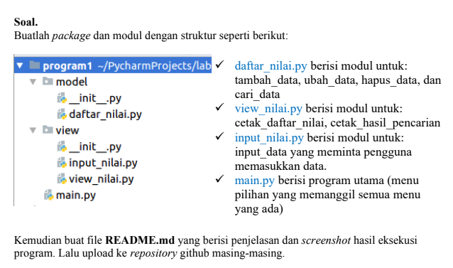
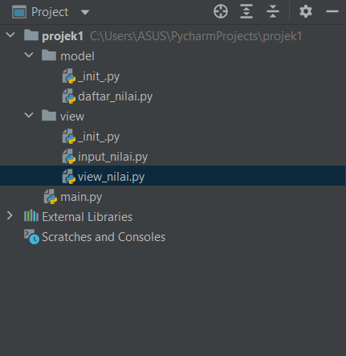

# UAS2022
## MATA KULIAH B-PEMOGRAMAN
## NAMA     : TJOKRO WINATA
## NIM      : 312110276
## KELAS    : TI.21.A.2

### Sesuai dengan tugas UAS yang diberikan



- daftar_nilai.py berisi modul untuk tambah data, ubah data, cari data, hapus data
- view_nilai.py berisi modul untuk cetak daftar nilai, cetak hasil pencarian
- input_nilai.py berisi modul untuk input data yang diminta pengguna untuk memasukkan data
- main.py berisi program secara keseluruhan

### Projek Saya



### Beberapa penjelasan mengenai program

- program daftar_nilai.py
```python
from view.input_nilai import *

dataMahasiswa = {}


def tambah_data():
    global dataMahasiswa
    nama = input_nama()
    nim = input_nim()
    nilaiTugas = input_nilaiTugas()
    nilaiUts = input_nilaiUts()
    nilaiUas = input_nilaiUas()
    nilaiAkhir = (0.30 * nilaiTugas) + (0.35 * nilaiUts) + (0.35 * nilaiUas)
    dataMahasiswa[nama] = nim, nilaiTugas, nilaiUts, nilaiUas, nilaiAkhir
    print("\nData Berhasil Ditambahkan!")
    return dataMahasiswa

def ubah_data():
    nama = input("Masukkan Nama: ")
    if nama in dataMahasiswa.keys():
        nim = input_nim()
        nilaiTugas = input_nilaiTugas()
        nilaiUts = input_nilaiUts()
        nilaiUas = input_nilaiUas()
        nilaiAkhir = (0.30 * nilaiTugas) + (0.35 * nilaiUts) + (0.35 * nilaiUas)
        dataMahasiswa[nama] = nim, nilaiTugas, nilaiUts, nilaiUas, nilaiAkhir
        print("\nData Berhasil Di Update!")
    else:
        print("Data tidak ditemukan!")


def hapus_data():
    nama = input("Masukkan Nama:  ")
    if nama in dataMahasiswa.keys():
        del dataMahasiswa[nama]
        print("Data",nama, "Telah dihapus!")
    else:
        print("Data Mahasiswa Tidak Ada".format(nama))
```
- program view_nilai.py
```python
from model.daftar_nilai import *


def cetak_daftar_nilai():
    if dataMahasiswa.items():
        print("\n                      DAFTAR NILAI MAHASISWA                    ")
        print("==================================================================")
        print("| No |     Nama     |    NIM    | Tugas |  UTS  |  UAS  |  Akhir |")
        print("==================================================================")
        i = 0
        for x in dataMahasiswa.items():
            i += 1
            print("| {6:2} | {0:12s} | {1:9s} | {2:5} | {3:5} | {4:5} | {5:6} |".format(x[0], x[1][0], x[1][1], x[1][2], x[1][3], x[1][4], i))
        print("==================================================================")
    else:
        print("\n                      DAFTAR NILAI MAHASISWA                    ")
        print("==================================================================")
        print("| No |     Nama     |    NIM    | Tugas |  UTS  |  UAS  |  Akhir |")
        print("==================================================================")
        print("|                          TIDAK ADA DATA!                       |")
        print("==================================================================")


def cetak_hasil_pencarian():
    nama = input("Masukkan Nama        : ")
    if nama in dataMahasiswa.keys():
        print("\n                   DAFTAR NILAI MAHASISWA                   ")
        print("==============================================================")
        print("|     Nama     |    NIM    | Tugas |  UTS  |  UAS  |  Akhir  |")
        print("==============================================================")
        print("| {0:12s} | {1:9s} | {2:5} | {3:5} | {4:5} | {5:6}  |".format(nama, dataMahasiswa[nama][0], dataMahasiswa[nama][1], dataMahasiswa[nama][2], dataMahasiswa[nama][3], dataMahasiswa[nama][4]))
        print("==============================================================")
    else:
        print("Datanya {0} Tidak Ada ".format(nama))
```
